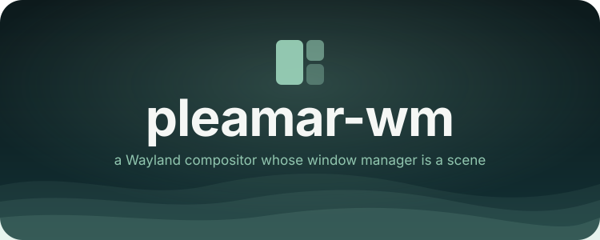

<div align = center>



<br>

[![Badge License]][License]
![Badge Language]
![Badge Commit]
[![Badge Issues]][Issues]

<br>

pleamar-wm is a Wayland compositor whose window manager is a [pleamar] scene:
where windows go, how they arrive, how they leave and how they are dragged is
springs, rules and zones in a file you can rewrite — and saving it re-lays out
the open windows without closing anything.

<br>

---

**[<kbd> <br> Install <br> </kbd>][Install]**
**[<kbd> <br> Configure <br> </kbd>][Configure]**
**[<kbd> <br> Keys <br> </kbd>][Keys]**
**[<kbd> <br> pleamar <br> </kbd>][pleamar]**
**[<kbd> <br> Marea <br> </kbd>][Marea]**

---

<br>

</div>

# Features

- **The window manager is a scene**: layouts, decorations, animations and drag
  behaviour are a `.plm` file — copy it (`pleamar-wm scene`) and make it yours.
- **Tiled or free, per monitor, in one key**: five tiled layouts (leader left or
  right, columns, rows, grid), or free windows as on KDE/Windows — edges,
  corner, maximize, the one clicked on top. `Super+W` switches with an animation.
- **Every window rides a spring**: change your mind mid-drag and it turns without a jolt.
- **Drag with a live preview**: the others move aside as they would be; drop on
  a window to swap (also across monitors), on the other monitor to send it, or
  on the layouts strip to change the layout.
- **Minimize into [Marea]**: the window melts into a drop that falls into her
  island and becomes a little stone with the app's icon; click it to bring it back.
- **Its own session**: no compositor underneath — DRM/KMS page flips, libinput,
  libseat, per-monitor refresh (165 Hz next to 60 Hz), VRR, HiDPI and
  fractional scale, the cursor on the card's plane.
- **Runs ahead of the programs**: its threads have real-time priority like
  Hyprland's, so a browser loading pages never makes it stutter.
- **What programs expect**: XWayland, layer-shell (bars, Marea), screencopy
  (grim), session lock, idle, fullscreen, dialogs, menus past their window,
  drag and drop (also out of Marea into any window), clipboard managers, input
  methods, pointer lock for games, explicit sync, dmabuf with several planes.
- **One folder for your dotfiles**: `~/.config/pleamar` with `session.conf`,
  `keys.conf` (bindings to the scene's actions), `autostart` and your own scenes.

<br>

<div align = center>

# Gallery

<br>

![Preview Tiled]

<sub>Tiled, with Marea at the top: the one with the keyboard lit, the rest a step back.</sub>

<br>
<br>

![Preview Free]

<sub>Free windows (`Super+W`): glass drop buttons — put away into Marea, maximize, close.</sub>

<br>
<br>

</div>

# Install

With pleamar and Marea, in your home, from one line:

```sh
curl -fsSL https://raw.githubusercontent.com/k4ditano/pleamar/main/install.sh | sh
pleamar-update --session     # and «pleamar-wm» in your login screen
```

Then log out and choose **pleamar-wm**, or from a TTY of its own (Ctrl+Alt+F3,
log in there): `pleamar-session`. `pleamar-update` keeps it up to date.

From the source, next to a clone of [pleamar] (`../pleamar`):

```sh
cargo build --release
./session.sh --seconds 45      # from a TTY: leaves by itself after 45 s
./target/release/pleamar-wm --scene examples/windows.plm   # nested, as a window of your compositor
```

# Configure

Everything of yours is in one folder, `~/.config/pleamar/` —the one for your
dotfiles—; `pleamar-wm init` makes it with a commented starting point and
never writes over what is there:

```text
~/.config/pleamar/
  session.conf     monitors, keyboard, pointer, idle (below)
  keys.conf        key bindings and touchpad gestures
  autostart        what starts with the desktop, one command a line
  wm/session.plm   your own window manager, instead of the one that comes with it
  shells/          your scenes: bars, widgets, apps
```

`keys.conf` binds keys to the window manager's actions —the events its scene
declares: `close`, `minimize`, `toggle_free`, `focus_next`…— or to programs.
Start it with `defaults` to keep pleamar-wm's and change what you want;
`pleamar-wm keys` shows them all:

```text
defaults
bind Super+b      launch zen-browser
bind Super+q      minimize
unbind Super+t
gesture swipe3_down close
```

Only `session.conf`, `keys.conf` and `wm/` are pleamar-wm's. Your shells work
on any compositor: on Hyprland, `exec-once = pleamar --autostart` starts the
same `autostart` (lines that begin with `wm:` are left for pleamar-wm's session).

`session.conf`, one thing a line (`config.example` has them all); what it does
not say is taken from Hyprland's configuration, so a desktop set up there comes
out the same. `pleamar-wm config` shows what it understood.

```text
monitor DP-3 1920x1080@165 at 0,0          # mode, refresh, where
monitor HDMI-A-1 preferred at 1920,0 scale 1.5
keyboard layout es repeat 25 delay 400
pointer accel flat
touchpad tap on natural on
idle off-after 600                          # the monitors go dark
```

In the login screen (SDDM, GDM): `pleamar-update --session` puts «pleamar-wm»
in the list of sessions. There, dbus and systemd are told where the desktop is,
and the portals (`pleamar-portals.conf`) share the screen through Hyprland's
portal and do the rest through GTK's.

# Keys

The ones that come with it (`pleamar-wm keys` prints them all), as on Hyprland:

| | |
| --- | --- |
| `Super+Return` · `Super+T` | a terminal |
| `Super+Q` | close the one with the keyboard (it goes at once) |
| `Super+M` · `Super+Shift+M` | put it away into Marea · bring the last one back |
| `Super+W` | tiled or free windows on this monitor |
| `Super+F` | fullscreen |
| `Super+Tab` | everything at a glance |
| `Super+arrows` | the keyboard to the next / previous window |
| `Super+Shift+arrows` | lead, move to the other monitor, change places |
| `Super+-` · `Super++` | the leader narrower / wider |
| `Super+Space` · `Super+L` | Marea's search · lock |
| `Print` · `Shift+Print` · `Ctrl+Print` | a piece, the screen, the window |
| three fingers down / up | close / fullscreen |
| four fingers sideways | the keyboard to the next / previous |

The keyboard goes to the window under the mouse, without a click (in free mode,
with a click, as on Windows). Ctrl+Alt+Backspace leaves; Ctrl+Alt+F1…F12 go
to another TTY and back.

# A session of its own

Without a compositor underneath: pleamar-wm takes the monitors and the input
through the seat (libseat, via logind; no root) and paints each monitor
straight into buffers of the card that go to the screen with page flips. From
a TTY of its own —Ctrl+Alt+F3 and log in there, not from inside a desktop—:

```sh
pleamar-session --seconds 45   # the first time: it leaves by itself after 45 s
pleamar-session                # the window manager, until Ctrl+Alt+Backspace
```

Every surface of the scene is shown: its own —one copy per monitor with
`screens: each`— and the named ones, a bar or a corner, each painted in frames
of its own and put together on the monitor by level and anchor, as
layer-shell would; the pointer goes to the highest one with a zone under it.

Other programs' layer-shell surfaces are put together on the same monitors,
by level, next to the scene's: `swaybg` paints the wallpaper under
everything, and Marea runs as she does on Hyprland, as a program of her own —
each of her surfaces on the monitor it asks for, the pointer where her input
region says, the keyboard when she asks for it—. Their buffers on the card
are read where they are, without copying them. The monitors have their real
names (`DP-3`), and the windows are listed with `wlr-foreign-toplevel`: the
title, the program, which one has the keyboard and on which monitor — what
pleamar's `window` service reads, and with it Marea's «follow me».

What starts with the session is in `autostart` (yours in
`~/.config/pleamar/autostart`): one command a line; by default the wallpaper
Marea has saved and Marea. Super+Space is her search.

Ctrl+Alt+Backspace leaves; Ctrl+Alt+F1…F12 go to another TTY and back. Its
log goes to `~/.local/state/pleamar-wm/session.log`, and the end of it is shown
when it leaves. `pleamar-wm probe` tries what the card needs for it —buffers
for the screen, painted by wgpu and read back— without taking the screen.

The language side —`windows`, `window`, `launch`, `focus`, `close`,
`promote`— is pleamar's and is documented in its reference (§10.3). This repo
is the compositor that fills it: the protocol side of
[Smithay](https://github.com/Smithay/smithay), with pleamar doing the painting.

# Where it is

It runs nested, as a window of your current compositor. Programs hand over
their frames on the card (linux-dmabuf, single plane, ARGB/XRGB with the
card's own modifiers) or in shared memory; each surface —the window, its
subsurfaces, its menus— is a piece of its own that pleamar draws in place. A
frame on the card is only taken once the program has finished drawing it, and
handed back once copied. Menus stay inside their window; the frames are the
scene's (server-side decorations); cursor shapes and a clipboard between its
windows.

Measured, a terminal redrawing 50 times a second:

| | terminal | pleamar(-wm) | Hyprland |
| --- | --- | --- | --- |
| straight on Hyprland | 3.5 % | — | 14.6 % |
| inside, with software GL | 192 % | 15.6 % | 10.9 % |
| inside, frames on the card | 5.4 % | 13.1 % | 16.8 % |
| inside, one round per frame | 5.4 % | 10.9 % | 16.5 % |

In the last row the terminal draws 89 frames a second, and pleamar-wm spends
about 1.2 ms of CPU on each (1.4 ms before): 0.6 of it painting, the rest
composing the scene and copying the frame on the card.

Glass: what is behind a program's surface is blurred where it asks
(`ext-background-effect`), which is Marea's card. A lock screen
(`ext-session-lock`, Super+L for Marea's) leaves nothing else seen or touched
on any monitor until it lets go.

Programs sync with the card explicitly when they can (`linux-drm-syncobj`):
they say when a frame is ready and are told when it is no longer read, instead
of the driver guessing it (with NVIDIA, a terminal spent a third less).

The cursor is the system's theme (XCURSOR_THEME, or what ~/.icons/default
inherits), on the card's cursor plane, with the shape whoever has the pointer
asks for. Other programs' bars keep their room (exclusive zones: the scene
reads `win.reserved.$s.top`…). Screenshots work (`wlr-screencopy`: grim, a
recorder, Marea's lens), and `pleamar-wm hyprctl monitors|activewindow` says
the desktop the way Hyprland does, for what used to ask it. Monitors can be
plugged in and out while it runs.

# What programs find

- **X11 programs** open like any other (XWayland: Steam, older games,
  xterm), their menus drawn with their window; copy and paste crosses both
  ways. `PLEAMAR_WM_NO_X11=1` leaves XWayland out.
- **Fullscreen** when they ask (F11, a video, a game) or with Super+F: over
  the whole monitor, other programs' bars stepping aside. **Dialogs** —a
  message, a file chooser— float over the rest at their own size.
- **HiDPI**: `scale 1.5` on a monitor line; programs are told the exact scale
  (fractional-scale, viewporter) and draw sharp at it.
- **Idleness**: `idle off-after`, or hypridle / swayidle / wlopm through
  ext-idle-notify and wlr-output-power-management; a video keeps the screen
  awake (idle-inhibit). `vrr` on a monitor line: variable refresh.
- **Touchpad**: three and four finger swipes and pinches are the scene's
  events (`swipe3_down`, `swipe4_left`, `pinch3_in`…); session.plm does as
  Hyprland did.
- And the usual: xdg-activation, the middle-click selection and clipboard
  managers (wlr and ext data-control), virtual keyboards (wtype), input
  methods (text-input, input-method), pointer lock and relative motion
  (games), xdg-foreign and xdg-dialog, ext-foreign-toplevel-list,
  presentation-time, content-type, single-pixel buffers.

`./apps-test.sh` opens each installed program alone, with no screen, and
says whether it got a window and drew in it: kitty, alacritty, GTK 3 and 4,
Qt (Dolphin), Firefox, Vulkan, OpenGL and GTK on X11 all do.

- **Menus** go past their window: in the session they are surfaces of the
  monitor, over everything, fitted to the monitor.
- **Drag and drop** between windows (the target is whatever is under the
  pointer, the icon follows it), onto the scene's `drop` zones, and out of
  another program's surface into the windows (Marea's finder: a file dragged
  from it lands in any program, via pleamar's `carries:`).
- **Buffers of several planes** and **video**: NV12 frames straight from a
  hardware decoder (Firefox with VA-API) and RGBA tiles are read on the card.

Not yet: touch screens and tablets, dragging out of the window manager's
own scene (its `carries:` zones), screen sharing tested end to end.

# Special Thanks

<br>

**[Smithay]** - *For the protocol side of the compositor*

**[pleamar]** - *For everything that is painted*

**[Hyprland]** - *For the keys, the gestures and the bar to measure against*

# License

pleamar-wm is under the [BSD 3-Clause License][License], like Hyprland.

<!----------------------------------------------------------------------------->

[Install]: #install
[Configure]: #configure
[Keys]: #keys
[pleamar]: https://github.com/k4ditano/pleamar
[Marea]: https://github.com/k4ditano/marea-plm
[License]: LICENSE
[Issues]: https://github.com/k4ditano/pleamar-wm/issues

<!----------------------------------{ Thanks }--------------------------------->

[Smithay]: https://github.com/Smithay/smithay
[Hyprland]: https://github.com/hyprwm/Hyprland

<!----------------------------------{ Images }--------------------------------->

[Preview Tiled]: assets/tiled.png
[Preview Free]: assets/free.png

<!----------------------------------{ Badges }--------------------------------->

[Badge License]: https://img.shields.io/badge/license-BSD--3--Clause-9ed6bd?style=flat-square
[Badge Language]: https://img.shields.io/badge/made%20with-Rust%20%2B%20pleamar-2c7684?style=flat-square
[Badge Commit]: https://img.shields.io/github/last-commit/k4ditano/pleamar-wm?style=flat-square&color=9ed6bd
[Badge Issues]: https://img.shields.io/github/issues/k4ditano/pleamar-wm?style=flat-square&color=2c7684
